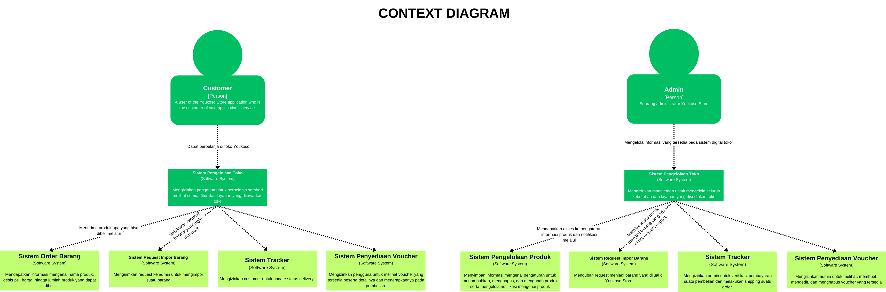

# tk-adpro
C4 Models dapat diakses di sini
https://www.canva.com/design/DAGF9EZm_2U/ekG2DfTbiNFU3PNT9SZdjQ/edit?utm_content=DAGF9EZm_2U&utm_campaign=designshare&utm_medium=link2&utm_source=sharebutton

# Context

# Container

BEFORE

AFTER

# Deployment

# Component

## Prod Management

## Voucher Management

## Request Management

## Order Management

## Payment Management

# Code

## Prod Management

## Voucher Management

## Request Management

## Order and Payment Management

Risk storming is a collaborative technique where team members from various roles identify, assess, and prioritize project risks. This method encourages open communication and ensures a comprehensive understanding of potential risks, leading to proactive risk management and informed decision-making.

In our project, we applied risk storming to discuss the potential risks of implementing an API Gateway Server. This helped us identify technical, operational, and security risks, ensuring seamless integration, addressing security concerns, and considering performance and scalability. By prioritizing these risks, we developed a comprehensive risk management plan to mitigate potential issues effectively. Implementing an API Gateway offers several benefits:

- An API Gateway provides a single entry point for all client requests, simplifying API management and monitoring.
- It helps secure the system by managing authentication, authorization, and threat protection centrally.
- The API Gateway can distribute incoming traffic across multiple services and enforce rate limits to prevent overloading.
- By caching responses and offloading tasks like SSL termination, the API Gateway can enhance overall system performance.
- It facilitates seamless integration of new microservices and third-party APIs, making the system more adaptable to changes.